# End to end

One feature, from a sentence in your head to green PRs, through the four skills in
this folder. The example is `PROJ-101` — letting a school undo a bulk credential
issuance — carried the whole way so the artefacts connect.

Read this if you want to know what the chain actually costs you before installing
it. Six moments need a human per run; everything between them runs.

## The chain

```mermaid
flowchart TD
    classDef human fill:#fde68a,stroke:#b45309,stroke-width:2px,color:#1c1917
    classDef doc fill:#e0f2fe,stroke:#0369a1,color:#0c4a6e
    classDef stop fill:#fecaca,stroke:#b91c1c,color:#7f1d1d

    subgraph SETUP["/plan-setup · once per repo"]
        direction TB
        S1["Detect branch, paths, CI,<br/>check commands, PR titles"]
        S2["Confirm the gaps:<br/>tracker, project key,<br/>plans committed?"]
        S3["<b>.claude/plan-config.md</b>"]
        S1 --> S2 --> S3
    end

    subgraph BRIEF["/plan-brief · idea → ticket"]
        direction TB
        B1["Search tracker + codebase<br/>for prior art"]
        B2["Interview<br/>one question per turn"]
        B3["Self-check<br/>8 points, failures quoted"]
        B4["Read the PRD, correct it"]
        B5["<b>PRD</b> → ticket description"]
        B1 --> B2 --> B3 --> B4 --> B5
    end

    subgraph HAND["/plan-handover · ticket → handover"]
        direction TB
        H0{"PRD on<br/>the ticket?"}
        HX["Refuse.<br/>Run /plan-brief"]
        H1["Plan mode: explore, argue,<br/>collect decision material"]
        H2["Approve the prose plan"]
        H3["<b>Decision note</b><br/>→ draft PR [Plan - PROJ-101]"]
        H4["<b>Parent plan</b> + PR breakdown<br/>(one linear stack)"]
        H5["Say go to the list of<br/>sub-tickets to create"]
        H6["Create sub-tickets,<br/>append ## Plan to parent"]
        H7["<b>Sub-ticket plans</b> + descriptions<br/>sliced from the PRD + Blocks links"]
        H8["Commit plans onto<br/>the same plan PR"]
        H0 -->|no| HX
        H0 -->|yes| H1 --> H2 --> H3 --> H4 --> H5 --> H6 --> H7 --> H8
    end

    subgraph IMPL["/plan-implement · handover → green PRs"]
        direction TB
        I0["Paste the /goal line"]
        I1["Preflight: clean tree, gh auth"]
        I2["Gather plans off the branch,<br/>order from Blocks links"]
        I3["Front-loaded questions"]
        I4["Build one sub-ticket<br/>→ checks → self-review"]
        I5["<b>PR</b> stacked on the previous<br/>→ fix CI → green"]
        I6["Report: PRs, merge order,<br/>every decision made"]
        I7["Review and merge<br/>bottom-up"]
        I0 --> I1 --> I2 --> I3 --> I4 --> I5
        I5 -->|next sub-ticket| I4
        I5 --> I6 --> I7
    end

    S3 --> B1
    B5 --> H0
    HX -.-> B1
    H8 --> I0

    class S2,B2,B4,H2,H5,I0,I3,I7 human
    class S3,B5,H3,H4,H7,I5 doc
    class HX stop
```

Amber is you. Blue is an artefact that outlives the session.

## Human touchpoints

| # | When | What you do | Why it can't be automated |
|---|---|---|---|
| 1 | `/plan-brief` §2 | Answer the interview | It's your knowledge being extracted; that's the whole product |
| 2 | `/plan-brief` §4 | Read the PRD, correct it | Everything downstream trusts this document |
| 3 | `/plan-handover` §2 | Approve the prose plan | The "is this the right thing to build" decision |
| 4 | `/plan-handover` §4 | Say `go` to the list of sub-tickets it's about to create | Creating tickets is a public write to the team's board |
| 5 | `/plan-implement` §0 | Paste the `/goal` line | A skill cannot set a goal — it has to be typed |
| 6 | end | Review and merge | Green CI is not a passing review |

Plus one conditional: `/plan-implement` §3 batches every question it has —
a dirty tree, an unmappable sub-ticket, an ambiguity the decision note doesn't
settle — and asks them together *before* it starts. Often there are none.

`/plan-setup` runs once per repo, not per feature.

---

## Phase 0 — `/plan-setup`, once per repo

1. **You type** `/plan-setup` in the repo you'll be building in.
2. **It detects** what it can: integration branch (`git symbolic-ref`), repo slug,
   PR template, existing `docs/decision-notes/`, `CLAUDE.md` / `AGENTS.md` /
   `REVIEW.md`, wherever tasks are defined, the CI workflows, and the last 20 PR
   titles — because the real prefix convention is never the documented one.
3. **It asks only the gaps.** Tracker site and project key; which branch PRs target
   if the repo has both a `main` and a `develop`; whether the implementation plans
   are **committed or gitignored**; and the one question with no answer anywhere in
   the repo: *what do reviewers here push back on that CI doesn't catch?*
4. **It writes** `.claude/plan-config.md`. If plans are committed it checks
   `git check-ignore -v` first and shows you any rule that would silently swallow
   them, rather than forcing past it with `git add -f`.

Everything after this reads that file. Re-run it when conventions change.

## Phase 1 — `/plan-brief`, idea → ticket

5. **You type** `/plan-brief we need some way to undo a bulk issuance`.
6. **Before asking anything**, it searches the tracker for the same idea and the
   codebase for a half-built version — *"there's a `batch_reference` column
   already, nothing reads it"* — and reports what it found. A closed ticket that
   already rejected this changes the entire conversation, and it's cheaper to learn
   now than in question nine.
7. **The interview.** One question per turn, following `templates/prd.md`'s
   headings in order: Problem, Evidence, Who it's for, Outcome, Done when, In
   scope, Out of scope, Constraints, Open questions. The template *is* the
   interview — swap the file and the questions change.

   It presses when you hand it a solution instead of a problem, "users" instead of
   a person, an unfalsifiable outcome, a number with no source, or scope with no
   edge. Two presses maximum, then it records the gap and moves on — a stalled
   interview is worse than an imperfect answer. It asks once whether there's a
   date this has to be true by, and what makes that date real.
8. **Self-check before writing.** Eight points, failures quoted back at you:
   *"'most schools do this' — no source. Assumption, or do you have one?"* You fix
   it or it goes in labelled as what it is. Nothing passes silently, and it never
   fixes a gap by inventing the missing content.
9. **You read the PRD in full** and correct it.
10. **It writes the ticket** — creating `PROJ-101` if there wasn't one — setting
    both summary and description, and keeps `docs/plans/PROJ-101-prd.md` as the
    local copy. It will not overwrite a description that already has content.
11. **It hands off**: the open questions you now owe someone, anything you said
    while accidentally designing (saved for the next skill), and the next command
    ready to paste.

## Phase 2 — `/plan-handover`, ticket → handover

12. **You type** `/plan-handover PROJ-101 — let schools undo a bulk issuance`.
13. **The gate.** It reads the ticket first. **No PRD, no planning** — it names
    what's missing and sends you to `/plan-brief`. A PRD isn't "the description has
    words in it": it states the problem independently of any solution, who hits it,
    what's in and out of scope, and how you'd know it worked. A hand-written brief
    in any shape passes if it answers those.

    Two overrides, both requiring you to say it out loud — *"this is the brief,
    go"* or *"skip the PRD"*, the latter recorded in the decision note. It will
    never take either on its own inference.
14. **Plan mode.** It explores properly, proposes an approach, and you argue.
    Throughout, it keeps a running note of decisions, the alternative a future
    reader would rediscover, and **assumptions that turned out wrong** — that last
    category only exists if captured mid-exploration.
15. **You approve the prose plan.** ⏸ What's in front of you is plain English:
    what can't be done today, what changes, the shape of the approach, the calls
    worth arguing with, what we're not doing, what we found out. No file lists —
    they'd bury the decision you're actually making. The technical version comes
    after.
16. **Decision note** → `docs/decision-notes/2026-08-25-bulk-revocation-by-batch.md`,
    with a `Status: planned` line and the commit its codebase facts were verified
    against. Branch `docs/<slug>`, commit, push, **draft PR titled
    `[Plan - PROJ-101]`** — that prefix is how these are told apart from real work.
    The branch stays checked out.
17. **Parent implementation plan** → `docs/plans/PROJ-101-<slug>.md`. Same
    decisions, now technical: phases, files, line numbers, and a **PR breakdown
    table** forcing the work into one *linear* stack. Not a preference — GitHub
    models a stack as a chain, so a PR whose base already has another child can't
    join it at all. Two genuinely independent tickets still get an order, and both
    plans say the dependency is presentational.
18. **It appends `## Plan` to the parent ticket** — four lines pointing at the
    decision-note PR and the plan file. The PRD above it is left alone: it's the
    requirement, and this skill is not its editor.
19. **It shows you the sub-tickets it's about to create** and waits. ⏸
    One word, then it creates them with `parent: PROJ-101`, summaries lifted from
    the breakdown table so the board and the plan use the same words. On a re-run
    it matches what already exists instead of duplicating.
20. **One plan per sub-ticket** → `docs/plans/PROJ-103-<slug>.md`, each written for
    someone who has opened only that ticket: what blocks it, what it unblocks, its
    files, its tests, and explicitly what belongs to a sibling.
21. **Sub-ticket descriptions are slices of the PRD** — the `In scope` bullets and
    `Done when` checks *this* PR delivers, in the PRD's own words, so the
    implementer reads the sentence the brief promised rather than a paraphrase two
    documents downstream. Every bullet and every check must be claimed by exactly
    one sub-ticket: unclaimed means the breakdown has a hole, claimed twice means
    two people are about to build it. Then `Blocks` links so the board shows the
    real order.
22. **It commits the plans onto the plan PR** and pushes. One PR now carries the
    reasoning and the plans, reviewable together, fetchable from any machine. (In a
    repo that gitignores the plans directory, they stay local and you attach them
    by hand instead — the config decides.)

## Phase 3 — `/plan-implement`, handover → green PRs

23. **You type** `/plan-implement PROJ-101`.
24. **It prints the `/goal` line.** ⏸ Pasting it is the go signal — a skill can't
    set a goal, and without one the session stops after a turn. The condition asks
    for `gh pr checks` output every turn, because the evaluator judges the
    transcript and can't run tools.
25. **Preflight**: clean tree (it will not stash your work), `gh auth status`,
    checkout and pull the integration branch.
26. **It gathers the plans.** Committed, it fetches the plan branch and checks out
    the directory — no copying between machines. It also pulls the decision note
    off that same unmerged branch with `git show`, since it isn't on the
    integration branch yet. Parent plans written in plan mode sometimes sit in
    `~/.claude/plans/` under a generated name; it looks there before concluding a
    plan is missing.
27. **The tracker gives it the order** — `subtasks` and the `Blocks` edges. The
    board is authoritative; the plans only restate it.
28. **It prints the chain and asks everything it has.** ⏸ Last interruption. You
    walk away after this, so a question that surfaces on ticket four costs you the
    whole gap.
29. **Builds sub-ticket 1.** Branch, follow the plan, stay inside scope — what the
    plan assigns to a sibling is not its to build. Gaps in the plan get **decided,
    not escalated**, and every one lands in the PR body under
    `## Implementation decisions` with the alternative and why it lost. That's the
    deal: autonomy in exchange for auditability in one place.
30. **Proves it** through the repo's wrapper, in the config's order — format,
    static analysis, architecture rules, the relevant tests, frontend tests if the
    diff touches the frontend. Never the bare binary on the host.
31. **Reviews its own diff before the PR exists.** `/code-review high` for fresh
    eyes, then your repo's checklist, then the classes of failure CI can't catch:
    authorisation scoping on the base query rather than an optional filter,
    forbidden-path coverage, behaviour changes shipped inside a "refactor".
32. **Opens the PR** `[PROJ-103] <title>`, fills your template, adds the decisions
    section, then watches `gh pr checks` and fixes what fails — `git pull` first if
    a lint job auto-committed to the branch, extract a helper rather than reword if
    a duplication gate bites.
33. **Updates the progress file**, returns to the integration branch, and starts
    the next sub-ticket — **based on the previous ticket's branch**, not the
    integration branch. Repeats 29–33 per ticket, without stopping to report.
34. **Final report**: one line per PR, the bottom-up merge order, and every
    autonomous decision collected in one place rather than scattered across five PR
    bodies.
35. **You review and merge.** ⏸ It never merges. Green CI is the end state.

---

## The four documents

Each has one audience, and that's why there are four rather than one.

| Document | Written by | For | Answers |
|---|---|---|---|
| **PRD** — ticket description | `/plan-brief` | Anyone, including non-engineers | Why, and what |
| **Decision note** — on the draft PR | `/plan-handover` | Whoever debugs this in a year | Why *this* approach, and what we rejected |
| **Implementation plans** — on that same PR | `/plan-handover` | Whoever builds it, cold | What to do, in what order |
| **PR bodies** | `/plan-implement` | This week's reviewer | What changed, and what was decided along the way |

No section appears in two of them. The PRD carries no hypothesis, metrics,
alternatives or rollout — alternatives and trade-offs are the decision note's job,
and a metrics table without instrumentation is a table of invented numbers.

## Where it stops on purpose

- **No PRD** → refuses, sends you to `/plan-brief`.
- **No config** → refuses, sends you to `/plan-setup`.
- **Dirty working tree** → stops rather than stashing your work.
- **A description with content it didn't write** → shows you and asks.
- **Sub-tickets that don't map onto the PR breakdown** → says which, doesn't guess.
- **A plan that's nowhere on disk** → asks for it rather than reconstructing one
  from the ticket summary.
- **Merging** → never. That's yours.
